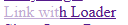
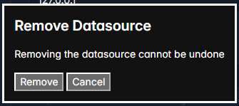

# ZSX.js

Build a ***Zero-Script UX***

ZSX is a dependency free progressive enhancement library for server-rendered web applications. ZSX uses only semantic HTML, CSS, URLs, links, forms, and buttons to improve the user experience without any additional developer javascript.

```html
<!-- Swap out the element from the response of a link click into the page -->
<a href="/page" zx-swap="body">Click Me</a>
```

ZSX is spiritually closest to [Unpoly](https://unpoly.com/), and similar to frameworks like [HTMX](https://htmx.org/), [Twinspark](https://twinspark.js.org/), [Turbo](https://turbo.hotwired.dev/) and [Fixi.js](https://github.com/bigskysoftware/fixi), but with an opinionated featureset.

Our building of [ChartSQL Studio Editor](https://docs.chartsql.com) was the source and inspiration for ZSX.


## Table of Contents

- [Quick Start](#quick-start)
- [Features](#features)
- [HTML API](#html-api)
- [Events API](#events)
- [ZSX Design Goals](#zsx-design-goals)
- [Developing Applications](#developing-applications)
- [Cookbook](#cookbook)

# Quick Start

Include the zsx.js script. It can be in the head or end of the body

```html
<head>
	<!-- Style sheet for ZSX loading indicator styles -->
	<link rel="stylesheet" href="dist/zsx.css">
	<script src="dist/zsx.js"></script>
</head>
```

```html
<body>
	<!-- ... Content ... -->
	<script src="dist/zsx.js"></script>
</body>
```

↑ [top](#zsxjs)

## Basic Example

```html
<!--- SERVER SIDE RENDERED HANDLEBARS TEMPLATE --->
<html lang="en">
<head>
	<meta charset="UTF-8">
	<meta name="viewport" content="width=device-width, initial-scale=1.0">
	<link rel="stylesheet" href="dist/zsx.css">
	<script src="dist/zsx.js"></script>
	<title>ZSX - QuickStart</title>
</head>
<body>
	<h1>ZSX QuickStart</h1>

	<a href="?hello=true" zx-swap="#targetContent">Hello</a>
	<a href="?hello=false" zx-swap="#targetContent">Good Bye</a>

	<div id="targetContent" style="width: 300px; height:100px;">
		{{#if url.hello}}
			Hello World
		{{else}}
			Goodbye World
		{{/if}}
	</div>
</body>
</html>
```

↑ [top](#zsxjs)

# Features

ZSX upgrades links, forms and buttons to make applications more responsive and solve common UX patterns.

**Page Fragment Updates**:
 - [Swap Client Side Content without Refresh](#swap-client-side-content-without-refresh) — [`zx-swap`](#zx-swap)
 - [Preserve Client-Side State During Swaps](#preserve-client-side-state-during-swaps) — [`zx-keep`](#zx-keep)

**Enhanced Visual Fidelity**:
 - [Automatic Page Jump Supression](#automatic-page-jump-supression)
 - [Visual Loading Indicators](#visual-loading-indicators) — [`zx-loader`](#zx-loader)
 - [Scroll Elements Into View](#scroll-elements-into-view) — [`zx-scroll-to`](#zx-scroll-to)
 - [Action Confirmation Dialogs](#action-confirmation-dialogs) — [`zx-dialog-confim`](#zx-dialog-confirm)
 - [App-Style Links](#app-style-links) — [`zx-link-mode`](#zx-link-mode)

**Navigation and State Management**:
 - [Synchronize URL Parameters Across Links](#synchronize-url-parameters-across-links) — [`zx-sync-params`](#zx-sync-params)
 - [Automatic History Management](#automatic-history-management)


↑ [top](#zsxjs) | *next:* [Features](#features)

## Swap Client Side Content without Refresh

Dynamically update parts of your page by swapping elements based on their ID, class, or tag in response to link clicks or form submissions.

This technique allows you to update portions of your content without a full page reload, enhancing performance and user experience.

See [`zx-swap`](#zx-swap-string-list)

↑ [top](#zsxjs) | [Features](#features) | *next section* → [HTML API](#html-api)

## Preserve Client-Side State During Swaps

When swapping content, preserve dynamic client side media, canvas or content that should not be changed. You can mark which content needs to be maintained and it will be restored across swaps

See [`zx-keep`](#zx-keep-true--false)

↑ [top](#zsxjs) | [Features](#features) | *next section* → [HTML API](#html-api)

## Automatic Page Jump Supression

ZSX will minimize disruptive page jumps from removed content.

Typically in an application, when elements are removed from the DOM, the page may abruptly jump upward if the combined height of the remaining content and the viewport is less than the current scroll position.

ZSX actively monitors the content height of elements that are being swapped out and dynamically inserts just enough space at the end of the document.

***This feature is automatic and does not require any zx-attributes***

↑ [top](#zsxjs) | [Features](#features) | *next section* → [HTML API](#html-api)

##  Visual Loading Indicators

Easily add loading indicators to all of your links and buttons to improve responsiveness

**Links**

Links get a background color that moves from left to right to simulate a progress loading indicator



**Buttons**

Buttons get a background color that moves from left to right to simulate a progress loading indicator


See [`zx-loader`](#zx-loader)

↑ [top](#zsxjs) | [Features](#features) | *next section* → [HTML API](#html-api)

##  Scroll Elements Into View

Automatically scroll newly swapped elements into the viewport. Define custom scroll targets to ensure important content is brought into focus.

See [`zx-scroll-to`](#zx-scroll-to)

↑ [top](#zsxjs) | [Features](#features) | *next section* → [HTML API](#html-api)

## Synchronize URL Parameters Across Links

On link navigation, you can synchronize all links on the page to match particular URL variables of the clicked link. This allows you to swap small portions of the page, but ensure all other links on the page match the correct parameters.

See [`zx-sync-params`](#zx-sync-params-string-list)

↑ [top](#zsxjs) | [Features](#features) | *next section* → [HTML API](#html-api)

## Automatic History Management

All links and form redirects (to GET) update the browser history and allow the user to navigate back to previous URLs.

***This feature is automatic and does not require any zx-attributes***

↑ [top](#zsxjs) | [Features](#features) | *next section* → [HTML API](#html-api)

## Action Confirmation Dialogs

As a result of clicking links or buttons, ZSX can present a confirmation dialog before proceeding with the action. This allows you to quickly add a simple confirmation for risky actions.



See [`zx-dialog-confirm`](#zx-dialog-confirm)

↑ [top](#zsxjs) | [Features](#features) | *next section* → [HTML API](#html-api)

## App-Style Links

Convert traditional `<a>` tags into app-like buttons or interactive controls that blend seamlessly into your application's interface. App Links prevent the display of URL tooltips and the standard context menu, providing a cleaner, more cohesive user experience for full screen apps.

See [`zx-link-mode`](#a-zx-link-mode-browser--app)

<br/>

↑ [top](#zsxjs) | [Features](#features) | *next section* → [HTML API](#html-api)

# HTML API

ZSX works by adding attributes to your existing HTML markup.

| attribute | Description |
| --- | --- |
| [zx-swap](#zx-swap) | Swaps target selector content from the response of a link click or form post |
| [zx-sync-params](#zx-sync-params) | Syncronizes URL parameters across links |
| [zx-keep](#zx-keep) | Keeps specified content in the DOM after a parent element is swapped  |
| [zx-link-mode](#zx-link-mode) | Whether to render the link as a browser (default) link or an application clickable element |
| [zx-dialog-confirm](#zx-dialog-confirm) | Confirmation question before proceeding wtih the click |
| [zx-scroll-to](#zx-scroll-to) | Where to sroll to after the content swap |
| [zx-loader](#zx-loader) | Specify that the link or button should have a loading indicator |

## zx-swap

Swap out content in the current page with content from the response HTML. Specify the CSS selectors to target.

**Used on tags:** `<a>`, `<form>`

**Valid Values:**

- id: `zx-swap="#idSelector"`
- class: `zx-swap=".aClassSelector"`
- tag: `zx-swap="tag-selector"`
- Multiple selectors: `zx-swap="#idSelector,.aClassSelector,tag-selector`"

### Usage
`zx-swap` is the primary feature of ZSX. As a result of every link or form action, you describe which element(s) should be replaced from the response content.

#### Swap #id Target

Swap a single element by target id

```html
<a href="?hello=true" zx-swap="#targetContent">Hello</a>
```

#### Swap .class Target

Swap all elements matching the target class

```html
<a href="?hello=true" zx-swap=".targetContent">Hello</a>
```

<aside>


When a class target is defined, each element needs a unique id in order to disambiguate the elements

</aside>

#### Swap Tag Target

Swaps the elements matching the given tag

```html
<a href="?hello=true" zx-swap="body">Hello</a>
```

<aside>


When a tag target is defined, if there are more than one result, each tag will need its own Id

</aside>

#### Swap Multiple Targets

Swap multiple targets by providing a comma separated list

```html
<a href="?hello=true" zx-swap="#targetContent,#target2,.classTarget">Hello</a>
```


#### &lt;form&gt; zx-swap

Swap out the element from the form post content

```html
<form action="/" method="POST" zx-swap="#anchorTargetContainer">
	<button type="Submit">Form Swap</button>
</form>
```

#### Form Redirects

Forms can either be a GET request or a POST. Typically when a POST, the server should redirect back to a GET (POST-REDIRECT-GET style) so that the browser does not perform duplicate submits.

ZSX will update the URL history to the value of any GET redirect. POST redirects are not added to the history.

↑ [top](#zsxjs) | [Features](#features) | [HTML Api](#html-api) | *next section* → [Events](#events)

## zx-sync-params
***string list***

Synchronizes parameters from an `<a>` link click with other links on the page.

Used on tags: `<a>`

**Valid Values:**

- Single param: `zx-sync-params="foo"`
- Multiple params: `zx-sync-params="foo,bar"`

### Usage

You use zx-sync-params when you need to keep URL state synchronized across all links on the page, even when only a small subset of the page content is updated.

This is necessary when URL contains important state that should persist across subsequent clicks, but the content from the zx-swap does not touch all of the links on the page.

The logic performed is as follows:

- **WHEN** a link with `zx-sync-params` is clicked
- **FOR** each link on the page
- **FOR** each of the parameters in the clicked `zx-sync-params`
- **IF** that parameter is in the other link's `href`
- **THEN** pdate the parameter to the value of the parameter in the clicked link.
- **UNLESS** the other link itself contains a `zx-sync-params` with the same parameter name


`zx-sync-params` can take a single parameter or multiple parameters.

#### Single Parameter

```html
<a href="?hello=true" zx-swap="#targetContent" zx-sync-params="hello" >Hello</a>
<a href="?hello=false" zx-swap="#targetContent" zx-sync-params="hello" >Goodbye</a>
<a href="?hello=false" zx-swap="#targetContent" >Other Link</a>
```

#### Multiple Parameters

```html
<a href="?hello=true&foo=bar" zx-swap="#targetContent" zx-sync-params="hello,foo" >Hello</a>
```

**Bypassing Link Update**

Other links on the page which should maintain their parameter value can be excluded by having their own `zx-sync-params`.

For example, consider an element that needs to be visible or hidden. One link shows it, the other link hides it, all other links need to reflect the last action

```html
<a href="?showMessage=true" zx-swap="#pageContent" zx-sync-params="showMessage" >Show</a>
<a href="?showMessage=false" zx-swap="#pageContent" zx-sync-params="showMessage" >Hide</a>
<a href="?showMessage=false" zx-swap="#pageContent" >Other Link</a>

<div id="pageContent">
	Hellow World,
	{{#if url.showMessage}}
		<div>
			It is a good day!
		</div>
	{{/if}}
</div>
```

Because both the show and hide links have a zx-sync-params, that means the inverse link is ignored when updated. Therefore only the 'Other Link' gets updated to whatever show/hide link was clicked last.

↑ [top](#zsxjs) | [Features](#features) | [HTML Api](#html-api) | *next section* → [Events](#events)

## zx-keep
***true | false***

Keeps an an element and its descendants unchanged when a parent is swapped out. Useful for maintaining page level content like video, audio forms or other interactive content that should not be swapped.

**Used on tags:** any html element

**Values Values:**

- true: Keep the element when swapping out the parent
- false: Do not keep the element when swapping out the parent


### Usage

```html
<a href="/" zx-swap="#container">Update</a>
<div id="container">
	Updated Content
	<div id="someContent" zx-keep="true">
		Kept Conent
	</div>
</div>
```

<aside>


Element with zx-keep requires that an Id be set

</aside>

↑ [top](#zsxjs) | [Features](#features) | [HTML Api](#html-api) | *next section* → [Events](#events)

## zx-link-mode
***browser | app***

Specifies whether a link should behave like a regular browser link, or adopt a more application-like interaction.

**Used on Tags:** `<a>`

**Valid Values:**

- `"browser"`: (default) Maintains standard browser link behavior, including displaying URL tooltips and offering content menus. This is the default.
- `"app"`: Suppresses the URL tooltip and modifies the link's behavior to mimic a form button or application-like interaction.

### Example Usage:

```html
<a href="https://example.com/page" zx-link-mode="browser">Standard Link</a>
<a href="https://example.com/action" zx-link-mode="app">App-like Link</a>
```

### Use Cases

Browsers provide some default features for links like tooltips, right click menu, and clicked and unclicked states. For some application where we want a desktop like app experience, disabling these default browser behaviors is desired.

When `zx-link-mode="app"` the link is just clickable text. You handle all additional styling for the link.

↑ [top](#zsxjs) | [Features](#features) | [HTML Api](#html-api) | *next section* → [Events](#events)

## zx-dialog-confirm
***string***

Generates a confirmation dialog modal to confirm the action before proceeding with the link or button click.

**Used on Tags**: `<a>`, `<button>`

**Valid Values:** Any text string

There are additional attributes you can add to control the content:

- **zx-dialog-confirm-title**: Sets a title for the dialog
- **zx-dialog-confirm-yes**: The text of the yes/ok button
- **zx-dialog-confirm-no**: The text of the no/cancel button

### Usage:
You should ask user for confirmation of actions that are sensitive and cannot be easily undone, or that has side effects. For example, deleting a record which cannot be recovered. Typically this will be used on form buttons (because links/GET should not make permanent changes)

```html
<button zx-dialog-confirm="Continue?">Hello</button>
<a href="?hello=true" zx-dialog-confirm="Continue?">Hello</a>
```

↑ [top](#zsxjs) | [Features](#features) | [HTML Api](#html-api) | *next section* → [Events](#events)

## zx-scroll-to
***true | false | top | if-needed | CSS selector***

Tells ZSX to scroll to a particular element after completing a zx-swap. This can improve the user experience when the swapped elements may be out of view or we want to focus the new elements.

**Used on Tags:** `<a>`, `<button>`

**Valid Values:**

- **`true | false`**: When true, scroll to the first zx-swap selector element. When false, this disables zx-scroll-to and also default browser hash fragment scrolling.
- **`#idSelector`**: Scroll to the provided Id, regardless of the zx-swap selectors
- `.classSelector` : Any valid CSS selector. The first item returned will be the target of the scroll
- `"top"` : Scroll to the top of the page
- `"if-needed"` : Scroll to the element if it is out of view otherwise do not scroll

### Usage

Browsers by default include scrolling to a URL hash fragement identifier. You can use zx-scroll-to for more complex scrolling scenarios like classes, 'top' of page, or 'if-needed'

**Default Browser hash(#) identifier**

When zx-swap is applied, if there is an id hash in the URL, it will scroll to that ID. This is the browser's semantic way to scroll to.

```html
<a href="/page#elementId" zx-swap="#elementId">Link</a>
```

**Scrolling to the Swap Target**

When `zx-scroll-to="true"` it will scroll to the location of the `zx-swap`

```html
<a href="?hello=true" zx-swap="#targetContainer" zx-scroll-to="true">Hello</a>
```

#### Scrolling to the newest created element

Sometimes as a result of adding a new item to the page, we will want to scroll to that item, except we do not know a unique ID for it because it does not exist yet. You can use a complex class selector to scroll to the last (or first) item.

```html
<button type="submit" zx-scroll-to=":nth-last-child(1 of .classList)">
```

#### Disable Page Change Scrolling

By default, ZSX handles links to different pages (base paths) by scrolling to the top of the page. This matches default browser behavior and user expectations when switching pages.

You can disable this by setting zx-scoll-to="false" on your links that you want to maintain the current scroll position between pages.

```html
<a href="/page1" zx-swap="#targetContainer" zx-scroll-to="false">Hello</a>
<a href="/page2" zx-swap="#targetContainer" zx-scroll-to="false">Hello</a>
```

The reason for this behavior is that typically, in a multi-page appication, each page route is significantly different content. The usual experience is to start that page at the top of the content.

#### Smooth Scrolling

ZSX follows the browser/application level scroll setting. You can enable smooth scrolling by setting the `scroll-behavior` at the page level with CSS.

```html
<html lang="en" style="scroll-behavior: smooth;">
```

#### Scroll Margin

Sometimes you want the scroll location to be just above the target element. You define this in CSS on the element that will be scrolled to with CSS.

```html
<div id="myElement" style="scroll-margin-top: 20px;"></div>
```

↑ [top](#zsxjs) | [Features](#features) | [HTML Api](#html-api) | *next section* → [Events](#events)

## zx-loader
***true | false | cursor-wait | cursor-progress***

Adds a visual progress indicator to buttons and links for requests that take time to complete.

**Used on Tags:** `a`, `button`

**Valid Values:**
- **true**: Add a loading indicator when clicked
- **false**: Do not add a loading indicator
- **cursor-wait**: Change the cursor to the browsers default wait cursor
- **cursor-progress**: Change the cursor to the browsers default progress cursor

### Usage
Use `zx-loader` for any action which is not or nearly not immediate. There are different types of loading indicators to suit your design requirements.

- [`<a>` loading indicator](#a-loading-indicator)
- [`<a>` link with 'wait' cursor](#a-link-with-wait-cursor)
- [`<a>` link with 'progress' cursor](#a-link-with-progress-cursor)
- [`<button>` loading indicator](#button-loading-indicator)

#### `<a>` loading indicator

Animates the background of the text with a progress indicator. Useful for App-Style links or links that look like buttons.


```html
<a href="/path" zx-swap="#target" zx-loader="true">Link with Loader</a>
```

#### `<a>` link with 'wait' cursor

Uses the browsers default wait cursor style. Useful for regular links where you want to disuade clicking the element again.

```html
<a href="/path" zx-swap="#target" zx-loader="cursor-wait">Link with Wait Cursor</a>
```

<span style="cursor:wait;">Hover to Show Cursor</span>

You can override the `.zx-loading-cursor-wait` class if you need to customize the icon

```css
.zx-loading-cursor-wait {
	cursor: wait !important;;
}
```

#### `<a>` link with 'progress' cursor

Uses the browsers default progress cursor style. Useful for regular links where it's okay for the user to click again

```html
<a href="/path" zx-swap="#target" zx-loader="cursor-wait">Link with Progress Cursor</a>
```

<span style="cursor:progress;">Hover to Show Cursor</span>

You can override the `.zx-loading-cursor-progress` class if you need to customize the icon

```css
.zx-loading-cursor-wait {
	cursor: wait !important;;
}
```

#### `<button>` loading indicator

Animates the button with a simulated progress indicator and disables the button until the request completes


```html
<button type="submit" zx-loader="true">
	Loading Indicator
</button>
```

↑ [top](#zsxjs) | [Features](#features) | [HTML Api](#html-api) | *next section* → [Events](#events)

# Events
ZSX fires the following events that your application can listen to and perform additional actions.

| Event | Description |
| --- | --- |
| zsx.zx-swap.after | After a content zx-swap for one selector has been completed.

## zsx.zx-swap.after
Fired after the swap for a selector is completed. If the zx-swap contained multiple selectors, a `zsx.zx-swap.after` event is emitted for each selector.

**event.detail {object}**

* `oldElement` The old element that was swapped out. No longer exists in the DOM
* `newElement` Live DOM reference to the new element that was swapped in
* `selector` The selector that was used to locate the elements

### Usage
Use the `zsx.zx-swap.after` to process the content after ZSX is finished replacing it. You might use this to re-attach event listeners and state from other libraries or purposes that are lost after the swap.

See Cookbook [Restoring Events and Features After Swap](#restoring-events-and-features-after-swap)


↑ [top](#zsxjs) | [Features](#features) | [HTML Api](#html-api) | *next section* → [ZSX Design Goals](#zsx-design-goals)


# ZSX Design Goals

ZSX has an opinionated philosophy in regards to web application architecture that dictate it's featureset. Understanding these opinions will help you determine if ZSX is right for your development style.

ZSX is designed to enhance server rendered applications. It only uses semantic HTML and follows browser semantics. It improves the user experience of server rendered applications without breaking user’s expectations of browser behavior.

We built [ChartSQL Studio](https://docs.chartsql.com) with ZSX and followed these guiding principles:


- [URLs and HTTP is the Right Architecture](#urls-and-http-is-the-right-architecture)
- [Links, Forms, and Buttons Are All You (mostly) Need](#links-forms-and-buttons-are-all-you-mostly-need)
- [Web Components Are Not Necessary](#web-components-are-not-necessary)
- [Use Minimal Javascript](#use-minimal-javascript)
- [Assume Full Page Rendering](#assume-full-page-rendering)
- [Explicit Link and Form Handling](#explicit-link-and-form-handling)
- [Must Be Able to Hard Refresh](#must-be-able-to-hard-refresh)

Use Cases, Development Plans & Alternatives to ZSX
 - [When to Use ZSX](#when-to-use-zsxjs)
 - [Future Development](#future-development)
 - [Altenratives](#alternatives)


## URLs and HTTP is the Right Architecture

Regardless of how you render the front end of the application, we believe that URLs and HTTP (GET and POST) is broadly the right application architecture.

Web applications should be addressible by URLs (links) and state changes should be communicated to the server with POSTs (forms).

Applications should be decomposed into pages (/entity1, /entity2) representing different resources following a generally RESTful style.

It follows that HTML, links and forms are the natural way to work with this architecture.

↑ [top](#zsxjs) | [Features](#features) | [HTML Api](#html-api) | [Events](#events) | [ZSX Design Goals](#zsx-design-goals) | *next section* → [Developing Applications](#developing-applications)

## Links, Forms and Buttons Are All You (Mostly) Need

Modern HTML contains everything necessary for a user to interract with 99% of web applications in an accessible and semantic way. It is not necessary to reinvent form controls or client side routing mechanisms. Virtually any DOM driven user experience can be maniuplated with just links, forms and buttons. Many developers are not even aware of modern features of HTML.

More advanced visual fidelity can be achieved with minor javascript, canvas and WebGL functionality. But when you are working with the DOM, rely on links, forms and buttons unless it can't be achieved any other way.

↑ [top](#zsxjs) | [Features](#features) | [HTML Api](#html-api) | [Events](#events) | [ZSX Design Goals](#zsx-design-goals) | *next section* → [Developing Applications](#developing-applications)

## Web Components Are Not Necessary
A lot of front end development seeks to "componetize" HTML. "web components" in the general sense is not a new technology, it goes back to the earliest web frameworks like JSP. However, unless you are creating a "component library" for others to use, we do not believe web components aid in development of applications.

We believe that it is easiest and most maintainable to build web UIs in basic HTML pages.

ZSX exists to enhance that experience while staying true to the nature of HTML and HTTP.

↑ [top](#zsxjs) | [Features](#features) | [HTML Api](#html-api) | [Events](#events) | [ZSX Design Goals](#zsx-design-goals) | *next section* → [Developing Applications](#developing-applications)

## Use Minimal JavaScript

ZSX takes an minimalist approach to JavaScript. While some JS is necessary, we think JS heavy applications are not good UX.

We believe the best UX is based on fundamental HTML/HTTP, links and forms, and that “JS first frontends” are overly complex applications that are hard to maintain.

In a ZSX application, you should be able to look at the rendered HTML and understand exactly the interaction with the backend just by following the links and forms.

↑ [top](#zsxjs) | [Features](#features) | [HTML Api](#html-api) | [Events](#events) | [ZSX Design Goals](#zsx-design-goals) | *next section* → [Developing Applications](#developing-applications)

## Assume Full Page Rendering

In a ZSX application the server by default always fully renders full pages. ZSX provides features to hot swap elements on the page and avoid a full browser page reload.

Avoiding a full page reload improves performance of the browser. Browser performance is improved because it doesn't need to reflow the entire document. This performance improvement is perceived by the user as more responsive.

Full server renders might seem costly, but it greatly improves the maintainability of applications:

- Most pages in an application are fast enough that it doesn't matter.
- Forces developers to think through the first page load experience up front.
- Dissuades client side hydration which we consider an anti-pattern.
- "Premature optimization is the root of all evil" - You don't need to spend time optimizing the performance of pages that are seldom used.
- Caching of pages can be done server-size in a more robust manner

↑ [top](#zsxjs) | [Features](#features) | [HTML Api](#html-api) | [Events](#events) | [ZSX Design Goals](#zsx-design-goals) | *next section* → [Developing Applications](#developing-applications)

## Explicit Link and Form Handling

As compared to some similar libraries, ZSX does not automatically override all links or forms, because:

- The application will be most responsive when you swap the smallest amount of content necessary
- You should be able to inspect the HTML and understand what each link/form behavior is without having to know hidden information
- You should think through which content exactly needs to be updated from every click or form post.

Therefore when using ZSX, you explicitly decide for every link/form which content needs to be updated, and which zx-* features to apply.


↑ [top](#zsxjs) | [Features](#features) | [HTML Api](#html-api) | [Events](#events) | [ZSX Design Goals](#zsx-design-goals) | *next section* → [Developing Applications](#developing-applications)

## Must Be Able to Hard Refresh

A litmus test for web applications with proper UX is “can you hard refresh.” Many applications exhibit poor user experience on hard refresh:

- It takes a long time for the page to load
- Time to interaction is delayed as client side features are "hydrated"
- There may be a lot of flashing and layout thrashing as elements are loaded in
- States that were clicked through to are lost, and the user is back at some “root” page flow

This leads to many lost features native to browsers:

- Cannot share links
- Cannot bookmark links
- Cannot open a link in a new tab
- Cannot duplicate a tab
- Cannot refresh to see style changes when developing

↑ [top](#zsxjs) | [Features](#features) | [HTML Api](#html-api) | [Events](#events) | [ZSX Design Goals](#zsx-design-goals) | *next section* → [Developing Applications](#developing-applications)

## When to Use ZSX

If your application fundamentally works with JavaScript turned off, then ZSX is a good candidate to enhance your application.

If your application is fully SPA, then ZSX is not a good fit.

ZSX is a small library and will work well with other JS libraries.

↑ [top](#zsxjs) | [Features](#features) | [HTML Api](#html-api) | [Events](#events) | [ZSX Design Goals](#zsx-design-goals) | *next section* → [Developing Applications](#developing-applications)

## Future Development
ZSX will only add enhancement features that we find solve common tasks in our applications, without breaking fundemental browser architecture. HTML is continually evolving with new features that make browser apps more responsive and user friendly. We are betting on HTML/CSS/HTTP and Server Side Rendering as the engine of applications.

↑ [top](#zsxjs) | [Features](#features) | [HTML Api](#html-api) | [Events](#events) | [ZSX Design Goals](#zsx-design-goals) | *next section* → [Developing Applications](#developing-applications)

## Alternatives

ZSX is similar to HTMX and Unpoly.js in its fundamental philosophy of server rendered applications. However it differs from them in important ways:

### HTMX

HTMX seeks to add new non-standard “hypermedia” features to HTML. Essentially, it allows turning any element into a link, button, GET/POST/PATCH. This is not semantic and means that applications built in HTMX cannot work with JavaScript turned off.

We explicitly do not like that any element on the page can be an interaction point, instead [Links, Forms, and Buttons Are All You (mostly) Need](#links-forms-and-buttons-are-all-you-mostly-need).

### Unpoly.js

Unpoly.js is probably the closest philosophically to ZSX. However I consider it’s feature set more complex than I desire. I believe there are only a few necessary conventions that we need. Unpoly drifts away from semantic HTML with features like layers. In comparison, ZSX only enhances fundamental browser behavior.

Unpoly also has a lot of configurations for targeting different elements, parents, children, appending, prepending and automatically choosing ambiguous cases. I consider these uncessary and an anti-pattern.

Instead, with ZSX, you control your HTML, the IDs, and classes you wish to target. This makes it easier to maintain your HTML and understand your content updates. You can always look at the source HTML and know exactly what will happen.

### Turbo / Hotwire

Turbo is also another strategy to “dramatically reduce the amount of custom JavaScript” but it has different goals. It provides features like ‘Frames’ and ‘Streams’ to add additional architectural options. I believe that Turbo goes beyond what I believe satisfies that [URLs and HTTP is the Right Architecture](#urls-and-http-is-the-right-architecture)

↑ [top](#zsxjs) | [Features](#features) | [HTML Api](#html-api) | [Events](#events) | [ZSX Design Goals](#zsx-design-goals) | *next section* → [Developing Applications](#developing-applications)

# Developing Applications

Additional architectural tips and tricks for building maintainable and interactive web applications with ZSX

- [Understanding Application State](#understanding-application-state)
- [User Interactions](#user-interactions)
- [Using Loading Indicators](#using-loading-indicators)
- [Using Animations](#using-animations)


## Understanding Application State

State for an application UI can live in different architectural layers. Where you decide to store your state depends on how it needs to be accessed and interact with browser capabilities.

One of the most challenging decisions in designing an application is deciding just where the UI state should live. This guide gives some requirements and recommendations.

↑ [top](#zsxjs) | [Features](#features) | [HTML Api](#html-api) | [Events](#events) | [ZSX Design Goals](#zsx-design-goals) | [Developing Applications](#developing-applications) | *next section* → [Cookbook](#cookbook)

### Database/Backend

Use when the UI state must survive browser sessions or application restarts, you must store it in the database or persistent backend store. The application will load and render the database/backend state into the HTML.

↑ [top](#zsxjs) | [Features](#features) | [HTML Api](#html-api) | [Events](#events) | [ZSX Design Goals](#zsx-design-goals) | [Developing Applications](#developing-applications) | *next section* → [Cookbook](#cookbook)

### Server Session

Use when the UI state must not be shareable, does not need to be permenantly persisteted, but must survive page refreshes. Mutating session state requires interacting with the server. Your server will maintain the session variables and render them into HTML. With session state, all open tabs for one browser instance will have the same state.

↑ [top](#zsxjs) | [Features](#features) | [HTML Api](#html-api) | [Events](#events) | [ZSX Design Goals](#zsx-design-goals) | [Developing Applications](#developing-applications) | *next section* → [Cookbook](#cookbook)

### URL

Use when the UI state can be shareable, disclosable, and survive refreshes. The state is exposed to the user in the browser URL. URL state should be used whenever possible to match users expectations of browser functionality. URL state allows the page to be shareable, bookmarkable, deep linked, and opened in multiple tabs and multiple browsers independently.

↑ [top](#zsxjs) | [Features](#features) | [HTML Api](#html-api) | [Events](#events) | [ZSX Design Goals](#zsx-design-goals) | [Developing Applications](#developing-applications) | *next section* → [Cookbook](#cookbook)

### Cookies

Use when the UI state must not be shareable across users or browsers, and can be set by the client without posting to the server, but the cookies will be shared with the server. Cookies allow bi-directional synchronization of state with the browser and server. The server can use the cookies to control rendering output, and the client can also set the cookies (whereas the browser cannot set session data without a request to the server)

↑ [top](#zsxjs) | [Features](#features) | [HTML Api](#html-api) | [Events](#events) | [ZSX Design Goals](#zsx-design-goals) | [Developing Applications](#developing-applications) | *next section* → [Cookbook](#cookbook)

### localStorage

Use when the UI state must not be shareable, and does not or must not be shared with the server for rendering. The client can set and restore values on page load into localStorage

↑ [top](#zsxjs) | [Features](#features) | [HTML Api](#html-api) | [Events](#events) | [ZSX Design Goals](#zsx-design-goals) | [Developing Applications](#developing-applications) | *next section* → [Cookbook](#cookbook)

### Javascript/Page State

State which is stored in JavaScript runtime variables or set into HTML attributes we call “Page State”. Page State is never rendered by the server or shared with it. Page state should be kept to a minimum so that the convention of URL refreshing and link sharing is maintained. Typically page state will be used for minor UI elements like tooltips.

↑ [top](#zsxjs) | [Features](#features) | [HTML Api](#html-api) | [Events](#events) | [ZSX Design Goals](#zsx-design-goals) | [Developing Applications](#developing-applications) | *next section* → [Cookbook](#cookbook)

## User Interactions

Links and Forms are the bedrock of HTML and HTTP interaction through a browser. Links (&lt;a href&gt;) represent GET requests and Forms (&lt;form&gt;) represent POST requests.

Links and Forms are all that is truly required to create high fidelity browser applications.

You should build your application interaction elements entirely out of links and forms wherever possible. This is the most maintainable, accessible and straightforward way to build on the web.

ZSX enhances links and forms by providing features to control how to render the response content. It is the same response content that would have rendered had JS been turned off. But with ZSX, you can speed up your responsiveness of links and forms.

↑ [top](#zsxjs) | [Features](#features) | [HTML Api](#html-api) | [Events](#events) | [ZSX Design Goals](#zsx-design-goals) | [Developing Applications](#developing-applications) | *next section* → [Cookbook](#cookbook)

## Using Loading Indicators

Loading indicators should be used whenever the server response time can be greater than 100ms.

We do not automatically add loading indicators to every link/button because when they are not needed, they add unecessary distraction.

See [`zx-loader`](#zx-loader) for optionally adding loading indicators.

↑ [top](#zsxjs) | [Features](#features) | [HTML Api](#html-api) | [Events](#events) | [ZSX Design Goals](#zsx-design-goals) | [Developing Applications](#developing-applications) | *next section* → [Cookbook](#cookbook)

## Using Animations
In general, using animations and page transitions is an anti-pattern. The best UX is: ***Instantly change that which the user should notice***

The fastest change possible is simply to update the content. Animating content in and out is initially slick, but unecessary.

If you use any animations, they must do the following:
- Start immediately on the user click
- The user must never have to wait for the animation itself to finish to click the next action that is available.

This means that you cannot wait to start animations after a request has finished. It's too late and ***will make the application feel sluggish***

↑ [top](#zsxjs) | [Features](#features) | [HTML Api](#html-api) | [Events](#events) | [ZSX Design Goals](#zsx-design-goals) | [Developing Applications](#developing-applications) | *next section* → [Cookbook](#cookbook)

# Cookbook
Solving common application design tasks with ZSX

- [Restoring Events and Features After Swap](#restoring-events-and-features-after-swap)

## Restoring Events and Features After Swap
If you have other javascript that needs to be attached to the swapped elements, you can do so by listening on [`zsx.zx-swap.after`](#zsxzx-swapafter) event

```javascript
// Example resetting bootstrap tooltips and popovers after a swap
document.addEventListener('zsx.zx-swap.after', function(event) {

	// Get the new element from the swap event
	var element = event.detail.newElement;

	// Remove any existing tooltips and popovers if they exist
	var tooltips = element.querySelectorAll('.tooltip');
	var popovers = element.querySelectorAll('.popover');

	tooltips.forEach(function(tooltip){
		tooltip.remove();
	});

	popovers.forEach(function(popover){
		popover.remove();
	});

	// Select and add the tooltips
	var tooltipTriggerList = element.querySelectorAll('data-bs-toggle="tooltip"]')
	tooltipTriggerList.forEach(function(tooltipTriggerEl){
		return new bootstrap.Tooltip(tooltipTriggerEl)
	})

	// Select and add the popovers
	var popoverTriggerList = element.querySelectorAll('[data-bs-toggle="popover"]')
	popoverTriggerList.forEach(function (popoverTriggerEl) {
		return new bootstrap.Popover(popoverTriggerEl)
	});

})
```

↑ [top](#zsxjs) | [Features](#features) | [HTML Api](#html-api) | [Events](#events) | [ZSX Design Goals](#zsx-design-goals) | [Developing Applications](#developing-applications) | [Cookbook](#cookbook) | *next section* → [Common Errors](#common-errors)

# Common Errors

The following are common errors that ZSX will throw when misusing features

## ZSX: Multiple elements found with selector "${selector}" but no id found to disambiguate them.

When your zx-swap directive results in multiple elements, each element needs a unique id in order to be able to determine which content area is which

## ZSX: target is not an anchor or form element

# Alternatives

[https://github.com/alexpetros/triptych](https://github.com/alexpetros/triptych)

[https://github.com/bigskysoftware/fixi](https://github.com/bigskysoftware/fixi)

[https://leanrada.com/htmz/](https://leanrada.com/htmz/)

[https://twinspark.js.org/](https://twinspark.js.org/)

Swapping Algorithims

[https://github.com/bigskysoftware/idiomorph](https://github.com/bigskysoftware/idiomorph)